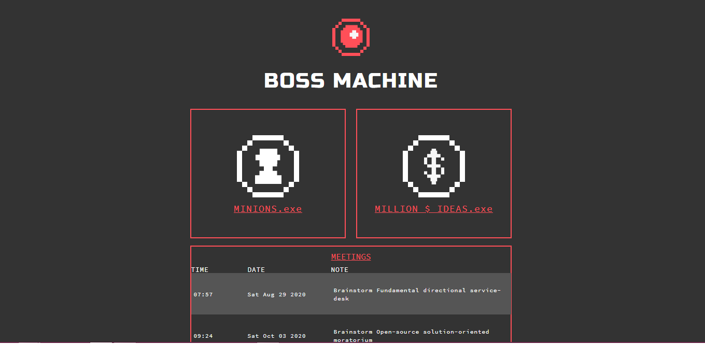
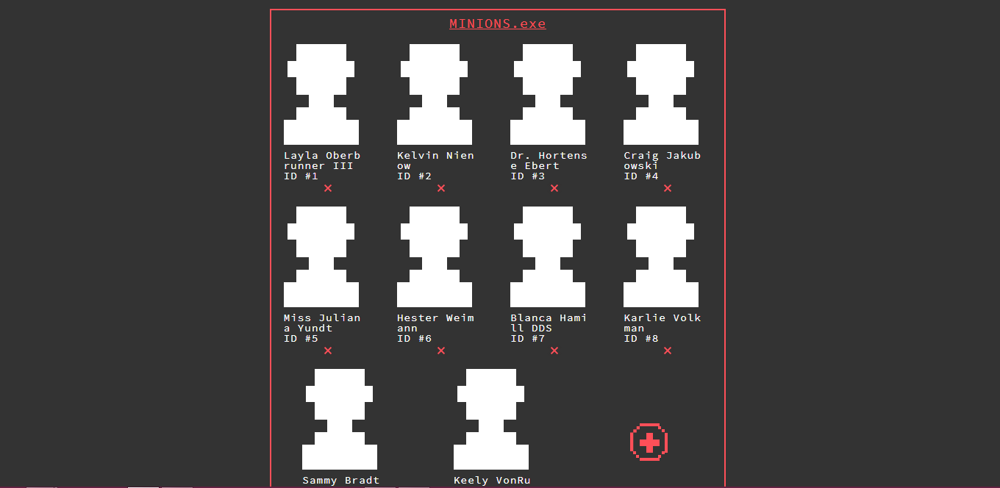
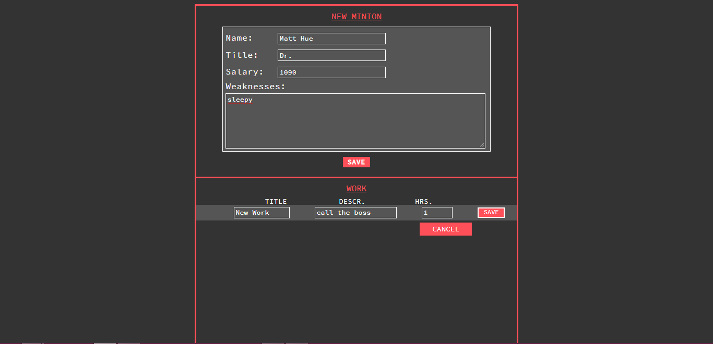
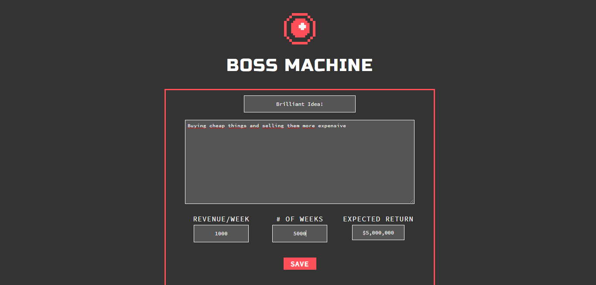

# Boss Machine

The point of this project was to create an API to serve information to a Boss Machine, a management application for entrepreneurs. In this project I created the routes (GET/PUT/POST/DELETE) in Express.js. The routes manage workers ('minions'), new ideas ('million dollar ideas') and meetings.

`npm run start` to begin server.

### Homepage

### Workers

### Add a new worker

### Add a new idea

